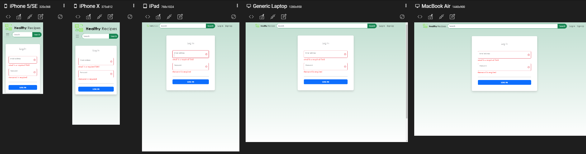

# Healthy-Recipes

Healthy Recipes is a saving and discovery of information on recipes from diferent sources. All in One place.

## UX/UI
* PowerPoint

## Front End
**Tech Used:**
* React.js
* TypeScript
* axios
* bootstrap
* redux
* yup
* react-toastify
* HTML5
* CSS
* enviroment variables

## Back End
**Tech Used:**
* TypeScript
* Node.js
* bcrypt
* cors
* dotenv
* express
* jsonwebtoken
* mongoose
* Mongo Atlas
* enviroment variables
## API Reference

| Method           |  URL             | Data Params      | Description      |
| ---------------- | ---------------- | ---------------- | ---------------- |
| POST     | /api/v1/auth/signup    | `{ firstName: "", lastName : "",user: "",email: "", password:""}`    | Sing Up    |
| POST     | /api/v1/auth/singin    | `{ email: "", password:""}`    | Sin In    |
| GET     | /api/v1/user/:id    | `{ id: "",}`    | get user    |
| PUT     | /api/v1/user/:id    | `{ id: "", {firstName: "", lastName : "",user: "",email: ""} }`    | Update user information    |
| DELETE     | /api/v1/user/:id    | `{ id: "",}`    | Delete user(Testing)   |
| POST     | /api/v1/recipe    | `{ user: "", recipeLink : "",recipeName: ""}`    | Save user's recipe    |
| GET     | /api/v1/recipes/:user    | `{ id: "",}`   | Get recipes from selected user    |
| DELETE     | /api/v1/recipe/:id    | `{ id: "",}`    | Delete recipe    |

#### API used for this project    

[Edamam recipe search API](https://developer.edamam.com/edamam-docs-recipe-api)


## Screenshots




#### Header


#### Footer


## Environment Variables

To run this project, you will need to add the following environment variables to your .env file

**Front End**

`REACT_APP_RESTFULL_API = https://api.edamam.com/api/recipes/v2?`

`REACT_APP_RESTFULL_API2 =https://api.edamam.com/api/recipes/v2/`

`REACT_APP_APIBACK = http://localhost:4000`

This variables can be find in  [Edamam recipe search API](https://developer.edamam.com/edamam-docs-recipe-api) once you create your account.

`REACT_APP_TYPE`

`REACT_APP_ID `

`REACT_APP_KEY`

**Back End**

_Cloud (Mongo Altas)_

The values can be find in [Mongo Atlas](https://www.mongodb.com/es/atlas/database) once you create an account and database. 


`MONGO_DATABASE`

`MONGO_USER`

`MONGO_PASSWORD`

_Local_

`MONGO_HOST = 'localhost'`

`PORT = 4000`

## Installation

Install Healthy-recipes with npm

```bash
  git clone https://github.com/martincorona007/Healthy-Recipes.git
  cd back-end
    npm install
    npm start
  cd front-end
    npm install
    npm start
```
## Production

[Link](https://profound-torrone-d9c57e.netlify.app/)


## Authors

- [@martincorona007](https://martincorona007.github.io/)

